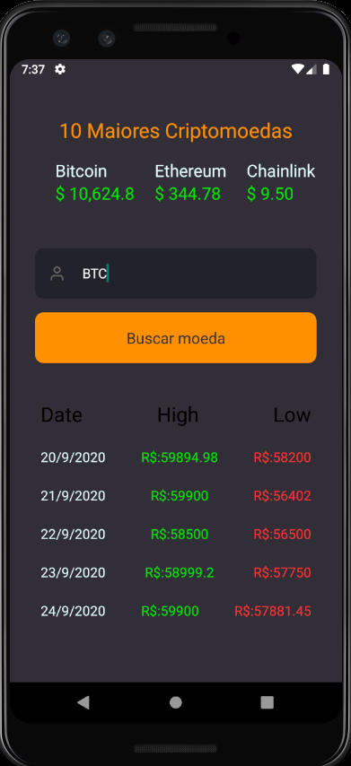

<h1 align="center">
  
</h1>

<h1 align="center">
  
  
</h1>

# Indice

- [Sobre](#-sobre)
- [Tecnologias utilizadas](#-tecnologias-utilizadas)
- [Utilizando uma Fake API](#-utilizando-uma-Fake-API)
- [Como baixar o projeto](#-como-baixar-o-projeto)
- [Como baixar o projeto](#-como-baixar-o-projeto)
---

## 🧾Sobre

O Projeto **GoCoin** é sistema para acompanhar as principais criptomoedas do mercado e visualizar o histórico dos ultimos dias da moeda virtual da sua escolha.

---

## 🛠Tecnologias utilizadas

O Projeto foi desenvolvido utilizando as seguintes tecnologias

- React Native
- Axios
- Typescript
- Styled-components
- Nodejs
- Express
- MongoDB

---
## 💾 Como baixar o projeto

### App

```bash

# Clonar o Repositório
$ git clone https://github.com/ArielCrivellaro/Go-Coin-App.git

# Entrar no Repositório
$ cd Go-Coin-App

# Instalar as dependências
$ yarn install

# Iniciar o Projeto no Android
$ yarn android

# Iniciar o Projeto no IOS
$ yarn ios

```

###  API Node


### [API - GoCoin](https://github.com/ArielCrivellaro/Go-Coin-Api.git)

---
## ❗❗❗ Informações importantes

### API utizada para a coletar os dados [API](https://min-api.cryptocompare.com/documentation?api_key=1b77159fd738954a7062f9ac985943cc43c326c63b70cec8613ebb96d36b3468)

### Lista das Criptomoedas e suas siglas para realizar a busca [Lista](https://www.cryptocompare.com/coins/list/USD/1)


---

### Desenvolvido por 😎 Ariel Crivellaro Martins